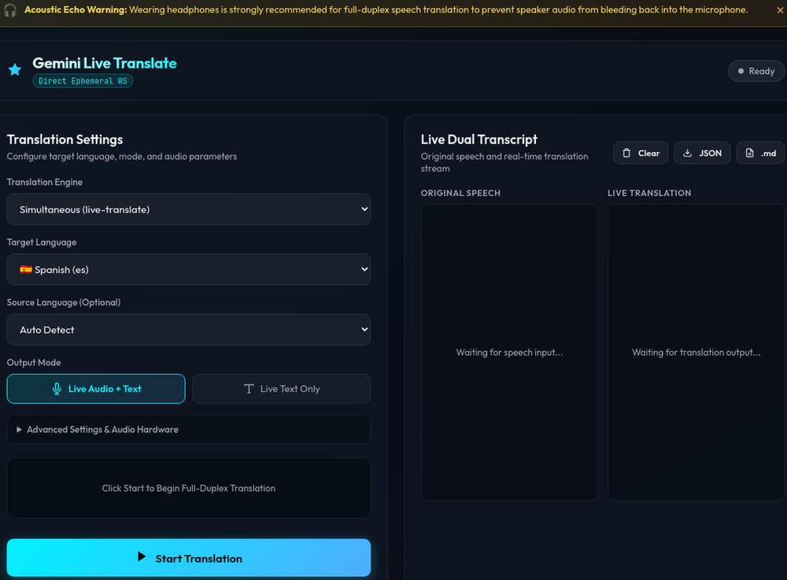

# Gemini Live Translate

Low-latency, continuous full-duplex speech translation in the browser. The
browser captures microphone audio, requests a short-lived Gemini Live
ephemeral token from the FastAPI service, then streams audio directly to
Gemini over WebSocket. Translated audio and text return on the same socket.

This repository contains the completed simultaneous-translation path and a
turn-based compatibility path. **Simultaneous** is the default and should be
used for continuous interpretation; **turn-based** remains available when a
model or deployment does not support `translationConfig`.

---

## What it looks like

A dark, centered panel with the translation engine, source/target language
pickers, output mode toggle, and expandable audio-hardware settings. Select your
options, then press **Start Translation** — the dual transcript below fills in
with the original speech and its live translation as you talk.



---

## Quick start

1. Copy `.env.example` to `.env` and set `GEMINI_API_KEY` (or `GOOGLE_API_KEY`).
   Do not commit the resulting `.env`.
2. Start the server:

   ```bash
   python -m venv venv
   . venv/bin/activate
   pip install -r backend/requirements.txt
   uvicorn backend.main:app --host 0.0.0.0 --port 8000
   ```

3. Open <http://localhost:8000>, grant microphone permission, choose the
   engine/languages/output mode, and press **Start Translation**. Use
   headphones for full-duplex audio to prevent speaker bleed and feedback.

  Docker Compose runs the same stack:

```bash
docker compose up --build
```

Open <http://localhost:8000> after the container is healthy.

---

## Deployment (Kubernetes)

The same FastAPI + frontend stack runs on Kubernetes. Apply the manifests in
`k8s/` in this order:

```bash
kubectl apply -f k8s/configmap.yaml
kubectl apply -f k8s/secret.example.yaml   # create the GEMINI_API_KEY secret
kubectl apply -f k8s/deployment.yaml
kubectl apply -f k8s/service.yaml
# HTTPS: install an ingress controller first, then provide a TLS secret.
kubectl apply -f k8s/ingress-controller.yaml   # replace placeholder with your release
kubectl apply -f k8s/tls-secret.example.yaml   # replace with a real cert
kubectl apply -f k8s/ingress.yaml
```

### HTTPS and allowed origins

Traffic is terminated at the `live-translate-ingress`, which redirects HTTP to
HTTPS (`ssl-redirect: "true"`) and serves the certificate from
`live-translate-tls`. The frontend and `/api/token` are then reachable at
`https://live-translate.example.com`.

`ALLOWED_ORIGINS` (ConfigMap → `env` → CORS) controls which browsers may call
the API and load the UI:

* During local development keep it at `*` (see `k8s/configmap.yaml`).
* Before exposing the service publicly, set it to the exact `https://` host(s)
  you are serving, e.g. `https://app.example.com`, and **remove the wildcard**
  so `allow_credentials` stays disabled in CORS.

```bash
kubectl set env configmap/live-translate-config ALLOWED_ORIGINS="https://app.example.com"
```

---

## Features

* **Continuous full-duplex translation** — audio is streamed as it is spoken,
  so partial target-language text and audio arrive before a source turn ends.
* **Two engines** — `Simultaneous (live-translate)` for live interpretation,
  and `Turn-based (legacy)` as a fallback for models that lack
  `translationConfig`.
* **Flexible languages** — target and optional source in names, two-letter
  codes, or BCP-47 values (`en-US`, `pt-BR`). Unknown values fall back to `en`.
* **Output modes** — `Live Audio + Text` plays 24 kHz PCM while showing text,
  or `Live Text Only` for transcript-only use.
* **Audio controls** — input device, playback volume, `Echo Target Language`,
  and browser echo cancellation, noise suppression, and AGC.
* **Transcript actions** — clear, export JSON history, or export Markdown.
* **Live Transcribe** — a speech-to-text pipeline (`translation_mode=transcribe`)
  for text-only transcription.

---

## Documentation

The full details have been moved into the `docs/` directory:

| Document | Purpose |
|---|---|
| [`docs/user-manual.md`](docs/user-manual.md) | Overview, start locally, interaction model, capabilities, and expected results |
| [`docs/technical-specs.md`](docs/technical-specs.md) | Architecture, token/setup protocol, audio pipeline, protocol parsing, file layout, deployment, and verification |
| [`docs/regeneration-prompt.md`](docs/regeneration-prompt.md) | Prompt to recreate the repository from scratch |

## Verification

```bash
pytest tests/ -v
node --test tests/js/protocol.test.js
python scripts/smoke_gemini.py       # requires a valid key and network
```
