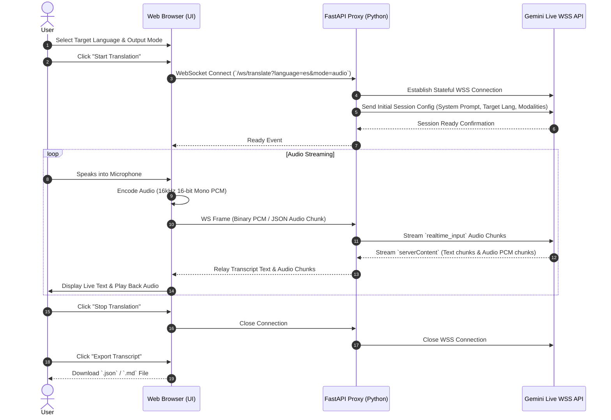

# Design Document: Live Translate Web Application

## 1. Executive Summary
The Live Translate Web Application is a real-time, low-latency speech-to-speech and speech-to-text translation platform powered by the **Gemini Multimodal Live API** (`gemini-3.5-live-translate-preview`). The application enables users to speak into their microphone and receive live translated text or synthesized speech in near real-time.

The application is packaged as a containerized solution (Docker & Kubernetes ready) with a high-performance Python FastAPI backend and a responsive modern web UI.

---

## 2. Core Requirements & Key Features

| Requirement | Description |
| :--- | :--- |
| **Model** | `gemini-3.5-live-translate-preview` (with fallback configuration options for `gemini-2.0-flash-exp` / Live WSS endpoint). |
| **Input** | Microhone audio stream (captured in browser, resampled to 16kHz 16-bit mono PCM). |
| **Output Modes** | 1. **Audio to Text** (Spoken source -> Live target text translation). 2. **Audio to Audio** (Spoken source -> Live target spoken audio translation + transcript text). |
| **Language Selection** | Configurable target languages (English, Chinese, Spanish, French, German, Japanese, Korean, Italian, Portuguese, Hindi, etc.). |
| **Start/Stop Control** | One-click activation and safe session termination. |
| **Transcript Recording & Export** | Continuous capture of all translated text snippets. Allows export as `.json` or `.md` files at any time, even in Audio-to-Audio mode. |
| **Containerization** | Production-ready `Dockerfile`, `docker-compose.yml`, and Kubernetes manifests (`deployment.yaml`, `service.yaml`, `configmap.yaml`). |
| **Authentication** | Zero friction (no user authentication required). API key supplied via server environment variable `GEMINI_API_KEY`. |

---

## 3. Architecture & Data Flow

---

## 4. Frontend Design & Aesthetics
- **Theme**: Dark mode with neon accents (Cyan `#00f2fe`, Purple `#4facfe`, Glassmorphism `#121826`).
- **Components**:
  - **Header Bar**: Live status indicator (Connected / Listening / Idle / Error), Model tag `gemini-3.5-live-translate-preview`.
  - **Configuration Controls**: Target Language selection dropdown, Output Mode toggle (Audio + Text vs Text Only).
  - **Audio Equalizer Visualizer**: Dynamic HTML5 Canvas canvas showing mic input waveforms during speech.
  - **Live Transcript Panel**: Auto-scrolling stream with timestamped speaker cards, highlighting translated output.
  - **Action Toolbar**: Large Start/Stop button with pulse animation, Clear Transcript, and Export Transcript button.

---

## 5. Backend Implementation Details
- **Tech Stack**: Python 3.12, FastAPI, Uvicorn, WebSockets, `google-genai` / `websockets` library.
- **WebSocket Gateway**:
  - Endpoint: `/ws/translate`
  - Query parameters: `target_language`, `output_mode`, `api_key` (optional override).
  - Translates client WebAudio PCM buffers into Gemini BidiGenerateContent frames.
  - Handles incoming model turns, extracts text parts for transcripts, and extracts audio parts (PCM 24kHz) for live playback.
- **Error Handling**: Graceful reconnects, standard error frames to frontend, API key validation alerts.

---

## 6. Deployment Artifacts
1. **Dockerfile**: Single container image building Python backend + serving static frontend files via FastAPI `StaticFiles`.
2. **docker-compose.yml**: Exposes port 8000, passes `GEMINI_API_KEY` from local environment or `.env` file.
3. **Kubernetes Manifests**:
   - `k8s/deployment.yaml`: Deployment with readiness/liveness probes.
   - `k8s/service.yaml`: LoadBalancer/NodePort service.
   - `k8s/configmap.yaml`: Config setup for environment configuration.

---

## 7. Verification & Testing Strategy
1. **Backend Tests**: `pytest` testing endpoints, WebSocket message parsers, audio chunk frame building, and config validation.
2. **Frontend Mock/Integration Check**: Validate static file delivery, Web Audio API script syntax, and WebSocket handlers.
3. **Container Build Test**: Execute `docker build` and `docker run` locally to confirm healthy container startup.
